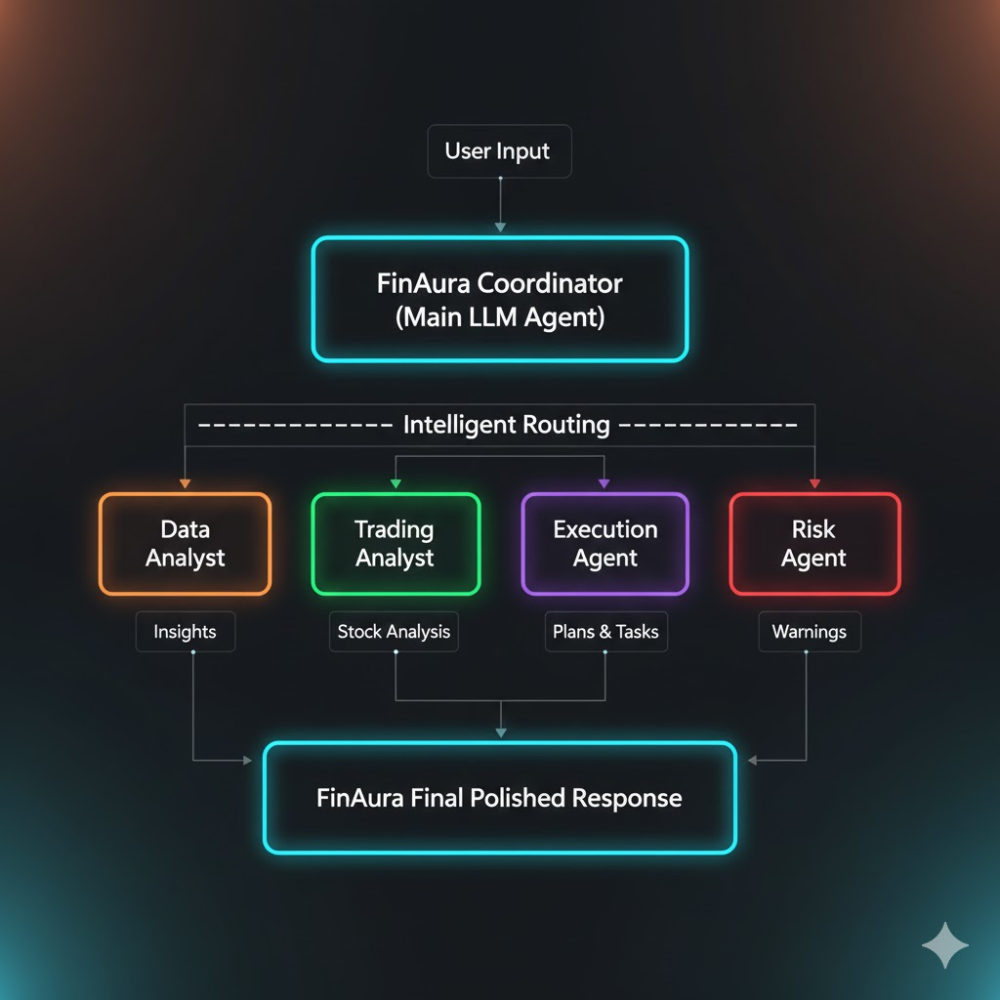

# 🌟 FinAura — Your Personal Financial Glow-Up Assistant  
### Built by **Srishti Rajput**

# 🌟 **FinAura — Your Personal Financial Glow-Up Assistant**  
### _Built by **Srishti Rajput**_

An **Intelligent Multi-Agent Financial AI** built with the **Google AI Agents Development Kit (ADK)**.

FinAura is a warm, friendly, and interactive financial assistant designed to help users analyze expenses, understand stocks, build budgets, visualize data, and generate personalized financial plans — all powered by a smart multi-agent architecture.

---
  # 🎥 Demo Video

Watch the FinAura demo:

👉 **[Click here to watch the demo video](https://github.com/CodeWithSrish/finaura-adk/releases/download/v1.0.0/FinAura_AI.mp4)**  
<video width="500" controls>
  <source src="https://github.com/CodeWithSrish/finaura-adk/releases/download/v1.0.0/FinAura_AI.mp4" type="video/mp4">
</video>

 ---

# 💫 **Meet FinAura**

FinAura speaks in a **bright, friendly female voice (Voice 3)** and always introduces herself with:

> **“Hi, I’m FinAura — your personal financial glow-up assistant. How can I help today?”**

Her tone is:

- Warm and approachable  
- Confident and clear  
- Educational without jargon  
- Supportive and positive  

FinAura feels less like a chatbot — and more like a personalized financial companion.

---

# 🧠 **Multi-Agent Architecture**

FinAura is powered by a team of specialized agents orchestrated by the main **FinAura LLM Coordinator**:

| Agent | Role |
|-------|------|
| **Data Analyst Agent** | Parses CSVs, receipts, statements & categories spending patterns |
| **Trading Analyst Agent** | Analyzes stocks, trends, technical indicators, bullish/bearish sentiment |
| **Execution Analyst Agent** | Converts insights into actionable strategies and recommendations |
| **Risk Analyst Agent** | Flags volatility, warnings, risky trades & financial exposure |

Together, they provide complete, actionable financial intelligence.

---

# ✨ **Core Capabilities**

## 📊 Spending & Transaction Intelligence
- Reads CSVs, statements, receipts  
- Detects overspending & hidden patterns  
- Creates clear summaries & category breakdowns  
- Offers smart insights for better money habits  

## 💰 Budgeting & Savings
- Builds personalized budgets  
- Optimizes monthly spending  
- Creates savings plans  
- Generates long-term financial projections  

## 📈 Stock & Market Analysis
- Analyzes stock tickers (AAPL, TSLA, etc.)  
- Provides bullish/bearish assessments  
- Highlights risks and volatility  
- Compares stocks side-by-side  

## 🛡 **Risk Insights**
- Detects unusual spending  
- Flags risky trades  
- Highlights downside risk & volatility  
- volatility alerts
- portfolio imbalance

---

# 🧩 **Project Structure**
<pre>
financial_buddy/
│
├── agent.py               # Main FinAura coordinator agent (orchestrates sub-agents)
├── prompt.py              # FinAura personality, tone, and main instructional prompts
├── root_agent.yaml        # ADK (Agent Development Kit) root configuration file
│
├── sub_agents/            # Directory containing the specialized sub-agent definitions
│   ├── data_analyst/      # Agent for cleaning and analyzing financial data (CSV, receipts)
│   ├── trading_analyst/   # Agent for monitoring stocks, trends, and market data
│   ├── execution_analyst/ # Agent for converting recommendations into actionable strategies
│   └── risk_analyst/      # Agent for assessing volatility and providing warnings
│
└── tools/                 # Directory for specialized Python functions (tools) the agents can use
│   ├── summarize.py           # Tool for condensing large amounts of data/reports
│   ├── expense_parser.py      # Tool for extracting details from receipts and transaction logs
│   ├── savings_projection.py  # Tool for calculating future savings and investment growth
│   └── data_store.py          # Tool for interacting with the persistent data layer 
│
├── README.md              # Project documentation (this file)
├── requirements.txt       # List of necessary Python dependencies
└── .env                   # Environment variables (e.g., API keys, configuration settings)
</pre>

---

# 🏗️ System Flow

---

# ⚙️ Installation & Setup

### 1️⃣ Clone the repository
<pre>
git clone <your-repo-url>
cd financebuddy-adk
</pre>

### 2️⃣ Create your venv 
<pre>
python -m venv .venv
source .venv/bin/activate      # Mac / Linux
.\venv\Scripts\activate        # Windows
</pre>

### 3️⃣ Install dependencies
<pre>
pip install -r requirements.txt
</pre>

### 4️⃣ Add your API key
<pre>
GOOGLE_API_KEY=your-key-here
</pre>

### 5️⃣ Start the ADK Web UI
<pre>
adk web
Open in browser:
👉 http://127.0.0.1:8000
</pre>
---

# 🎤 Example Prompts

Use these prompts inside the ADK Web UI to test each FinAura agent.

### 🧾 Data Analyst Agent (Spending / CSV Analysis)
Here is my spending for the past few months. Please analyze patterns, categories, and overspending:

Food: 320
Transport: 180
Shopping: 900
Bills: 1400
Entertainment: 760

Give me a final summary.

### 📈 Trading Analyst Agent (Stock Insight)
Analyze the stock ticker AAPL. Tell me if it's bullish or bearish, highlight key risks, and explain in simple terms.

### 📝 Execution Analyst Agent (Action Plan)
Create a simple 3-month financial plan for me.
My goal is to save ₹15,000.
Give me clear action steps I can follow.

### ⚠️ Risk Analyst Agent (Risk Evaluation)
Evaluate the risk of this portfolio:

AAPL 40%
TSLA 35%
BTC 25%

Highlight major risks, volatility, and your confidence level.

### 🔄 Full Multi-Agent Pipeline (All Agents Together)
Here is my financial profile:

Income: ₹60,000 per month
Expenses: ₹47,000 per month
Investments: AAPL, TSLA
Goal: Save ₹30,000 in 4 months

Analyze my spending, evaluate my stocks, create an action plan,
and perform a risk check. Give me a final coordinated summary.

### 🧠 Routing Check (Debug Prompt)
Which agent will handle this request? Identify the task category only:

"Summarize my spending this month."

---

# 📜 Disclaimer
FinAura is not a financial advisor.
All outputs are for educational and informational purposes only.
Always consult a licensed professional for financial decisions.
The developer (Srishti Rajput) is not responsible for financial losses.

---

# 📚 Resources

Here are useful references related to FinAura and the technology behind it:

- **Kaggle Competition Page**  
  🔗 https://www.kaggle.com/competitions *(replace with your actual link)*

- **Google AI Agents Development Kit (ADK) Documentation**  
  🔗 https://ai.google.dev/agents

- **Google Vertex AI Agents Overview**  
  🔗 https://cloud.google.com/vertex-ai/docs/agents

- **Python Markdown Guide**  
  🔗 https://www.markdownguide.org/

- **FinAura Demo Notebook (Kaggle)**  
  🔗 *(Add your Kaggle Notebook link once uploaded)*

If you enjoy this project, please ⭐ star the repo on GitHub!
---

  
  
  

